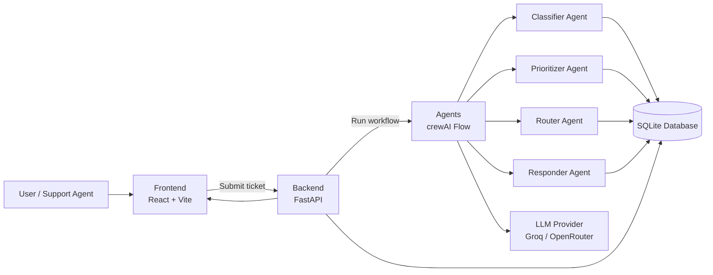

# Customer Support Escalation Router

Customer Support Escalation Router is an MVP for automating the first layer of customer support triage. It ingests a ticket, classifies the issue, assigns a priority, decides whether the case should be handled automatically or escalated to a human agent, and can generate a draft response for eligible tickets.

The project is split into three parts:

- A FastAPI backend that exposes the ticket analysis endpoints and persists results in SQLite.
- A crewAI-based agent pipeline that performs classification, prioritization, routing, and response drafting.
- A React + Vite frontend that provides the UI for submitting tickets and reviewing the trace.

## Features

- Ticket intake and analysis through a single API call.
- Multi-step agent workflow with trace output.
- Priority and routing decisions for support escalation.
- generate contextual response.
- SQLite-backed persistence for demo and audit purposes.

## Architecture



## Tech Stack

- Backend: FastAPI, Uvicorn, Pydantic, SQLite
- Agents: crewAI, Litellm, crewAI Flow
- Frontend: React, Vite, ESLint
- Runtime: Python 3.10+ and Node.js 18+

## Project Structure

The documentation below assumes the following final folder names:

- Root folder: `Customer Support Escalation Router`
- Frontend folder: `frontend`

Current workspace names may still differ, but the setup steps below use the target names for clarity.

```text
Customer Support Escalation Router/
  app/                # FastAPI backend
  agents/             # crewAI project and agent flow
  frontend/           # React + Vite application
  data/               # Demo JSON and local data files
  uploads/            # Uploaded or generated files
```

## Prerequisites

- Python 3.10 or later
- Node.js 18 or later
- Git
- `uv` installed for the agents environment

## Environment Variables

Create a `.env` file in the project root based on `.env.example`.

Common variables used by the backend and agents layer:

- `DATABASE_PATH` - SQLite file location, default: `data/router.db`
- `LLM_PROVIDER` - `groq` or `openrouter`
- `GROQ_API_KEY` - Groq API key
- `LLM_API_KEY` or `OPEN_ROUTER_API_KEY` - OpenRouter API key
- `LLM_MODEL` - Model identifier used by the agent workflow
- `LLM_BASE_URL` - Optional custom LLM endpoint

## Setup

### 1. Clone and enter the project

```bash
cd "Customer Support Escalation Router"
```

### 2. Frontend setup

If the Vite app has been renamed to `frontend`, run the following from that directory:

```bash
cd frontend
npm install
npm run dev
```

The development server usually runs at `http://localhost:5173`.

If you have not renamed the folder yet, use the current frontend directory name `customer support router` instead of `frontend`.

### 3. Agents setup

The agent workflow lives under `agents/` and uses its own Python environment.

Install `uv` first if it is not already available:

```bash
pip install uv
```

Install the crewAI CLI with `uv`:

```bash
uv tool install crewai
```

Create a virtual environment inside the `agents` directory and activate it:

```bash
cd agents
uv venv .venv
.venv\Scripts\activate
```

Install the local agents package into that environment so the backend can import `agents.main`:

```bash
uv pip install -e .
```

If you want to run crewAI tasks directly from the agents project, you can also use:

```bash
crewai run
```

### 4. Backend setup

Open a second terminal, return to the project root, and install the backend dependencies:

```bash
cd "Customer Support Escalation Router"
pip install -r requirements.txt
```

Start the FastAPI backend from the project root:

```bash
python -m uvicorn app.main:app --reload --log-level info
```

Make sure you run this command while you are inside the `Customer Support Escalation Router` directory.

## Running the Full Stack

1. Start the frontend dev server from `frontend/`.
2. Activate the `agents/.venv` environment and make sure the agents package is installed.
3. Start the backend from the project root with Uvicorn.
4. Open the frontend in your browser and submit a ticket.

## API Endpoints

- `GET /` - Health check
- `GET /tickets` - List stored ticket analyses
- `GET /tickets/{ticket_id}` - Retrieve a stored ticket analysis by ID
- `POST /analyze-ticket` - Run the agent workflow on a ticket

## Future Improvements

This project is still an MVP and can be significantly improved, with potential future integrations into tools like Slack, email systems, CRMs, or platforms such as Zendesk and Jira for real-world deployment at scale.

Additional improvements could include:

- Persistent database storage beyond the current demo-oriented SQLite setup
- Authentication and role-based access control
- Live integrations with support queues and ticketing systems
- Stronger observability, tracing, and retry handling for agent execution
- TypeScript migration for the frontend
- Production deployment with Docker and environment-specific configuration

## Notes

- The current workspace name may still be `router`, but the setup instructions assume the final project name `Customer Support Escalation Router`.
- The current frontend folder may still be named `customer support router`; the README assumes it will be renamed to `frontend`.
- The backend imports the local agents package, so the agents environment must be installed before the API is launched.

## License

No license file is included yet. Add one before publishing or sharing the project externally.